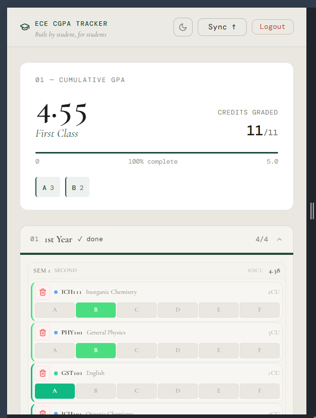
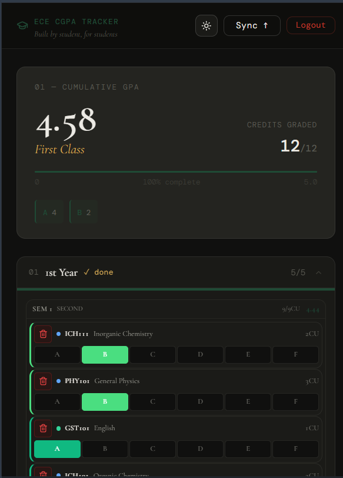
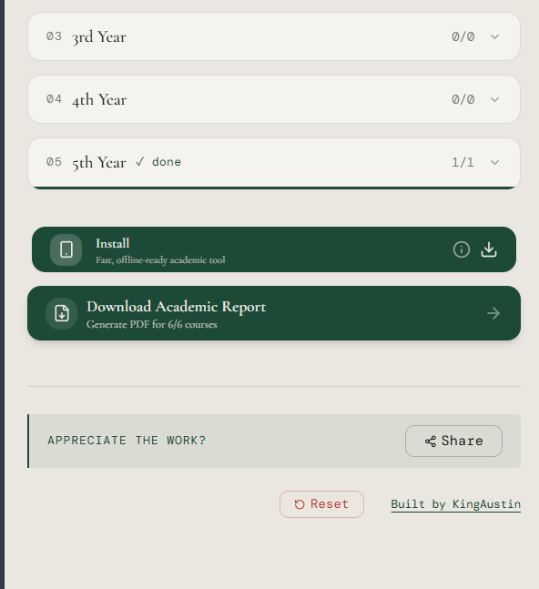

# ECE CGPA Tracker

> *A custom-built academic tool for students in the Electrical and Computer Engineering department — because the school's mobile app was never going to be enough.*


---

## The Problem

The school's official student portal can't keep up. Courses added late, non-departmental credit units missing, and no reliable way to know your standing before results come out officially. Students were doing manual calculations in notes apps, spreadsheets, or just guessing.

This app is the fix. Built by a student, for students in the ECE department — so you can track every course, every credit unit, and your live CGPA at any point in the semester.

---

## What It Does

You bring in your courses — from the school app, your course form, wherever — and add them here with their credit units and grades. The app calculates your CGPA live. If you switch phones or log in from a friend's device, your data follows you through cloud sync. If you'd rather keep it offline, it stays local. When you're done, you can export a PDF that mirrors the layout of a school transcript — useful for submissions while waiting for official signatures.

This started as a personal tool. It's now something I give back to my department.

---

## Screenshots

### Light Theme — CGPA Card & Grade Entry



The main interface in light mode. Your cumulative GPA displays in large editorial type with your classification (*First Class*, *Second Class Upper*, etc.) shown in italic below it. Each year expands to show semester courses with inline grade selection.

---

### Dark Theme



Full dark mode — designed as a first-class experience, not an afterthought. The accent color shifts from forest green to warm amber on italic text, per the design system. Toggle with the moon/sun button in the nav.

---

### Install, Export & Footer



The bottom of the app. Install it as a PWA for offline access, or download your Academic Report as a PDF — generated for however many courses you've graded. The footer includes a share button and a data reset option.

---

## Features

### Grade Tracking
- Add courses from any source — school portal, course form, department notice board
- Credit units per course, A–F grading scale (5.0 system)
- Live CGPA recalculates on every grade change
- Semester GPA shown per semester, cumulative across all years
- Grade distribution summary (how many As, Bs, etc.)

### Cloud Sync (Optional)
- Sign in with **Privy** (email, Google, or wallet — configurable)
- Grades sync to **Supabase** in the background as you type
- Load your data on any device, any browser
- On first sign-in: if cloud and local data differ, you choose which to keep
- Prefer to stay offline? Skip sign-in entirely — everything stays in `localStorage`

### Export
- **PDF Academic Report** — formatted like a transcript, with all courses, grades, credit units, semester GPAs, and your final CGPA
- **JSON export/import** — back up and restore your raw grade data

### PWA / Offline
- Installable on Android and iOS ("Add to Home Screen")
- Works fully offline once installed — no internet needed to view or update grades
- Service worker caches all assets

### UI
- Light and dark mode, both fully designed
- Sticky progress bar that appears as you scroll past the CGPA card
- Responsive — built mobile-first, works well on every screen size
- Cormorant Garamond serif + DM Mono type system (editorial, not generic)

---

## Grade Scale

| Grade | Points | Classification |
|-------|--------|----------------|
| A | 5.0 | Excellent |
| B | 4.0 | Very Good |
| C | 3.0 | Good |
| D | 2.0 | Fair |
| E | 1.0 | Pass |
| F | 0.0 | Fail |

### CGPA Classification

| Range | Class |
|-------|-------|
| 4.50 – 5.00 | First Class |
| 3.50 – 4.49 | Second Class Upper |
| 2.50 – 3.49 | Second Class Lower |
| 1.50 – 2.49 | Third Class |
| 1.00 – 1.49 | Pass |
| Below 1.00 | Fail |

---

## Tech Stack

| Layer | Technology |
|-------|-----------|
| Framework | React 18 + TypeScript |
| Build | Vite |
| Styling | Tailwind CSS + custom Recivo design system |
| Components | shadcn/ui (Radix UI primitives) |
| Auth | Privy |
| Database | Supabase (PostgreSQL) |
| PDF | jsPDF |
| PWA | vite-plugin-pwa |
| Deployment | Vercel |

---

## Getting Started

### Prerequisites

- Node.js v18+
- npm or bun

### Installation

```bash
git clone https://github.com/King-Austin/cgpa-tracker.git
cd cgpa-tracker
npm install
```

### Environment Variables

Create a `.env` file at the project root:

```env
VITE_PRIVY_APP_ID=your_privy_app_id
VITE_SUPABASE_URL=your_supabase_project_url
VITE_SUPABASE_ANON_KEY=your_supabase_anon_key
```

To enable Google sign-in via Privy, turn it on in your Privy dashboard first, then it works automatically.

### Run Locally

```bash
npm run dev
# → http://localhost:5173
```

### Production Build

```bash
npm run build
npm run preview
```

---

## Supabase Setup

Create this table in your Supabase project (SQL editor):

```sql
create table if not exists public.cgpa_user_data (
  user_id text primary key,
  data jsonb not null default '{}'::jsonb,
  updated_at timestamptz not null default now()
);
```

The app reads from and writes to `cgpa_user_data`. No other tables needed.

---

## Deployment

The repo includes a `vercel.json` with SPA routing configured. Connect the repo to Vercel, add your environment variables in the project settings, and deploy. Every push to `main` deploys automatically.

---

## Contributing

This project is open to contributions from ECE students and anyone who finds it useful.

```bash
git checkout -b feature/your-feature
# make changes
git commit -m "feat: describe your change"
git push origin feature/your-feature
# open a pull request
```

---

## License

MIT — use it, fork it, adapt it for your own department.

---

*Built by [KingAustin](https://nworahebuka.nworahsoft.codes/) · ECE Department · giving back to the department that shaped me.*
